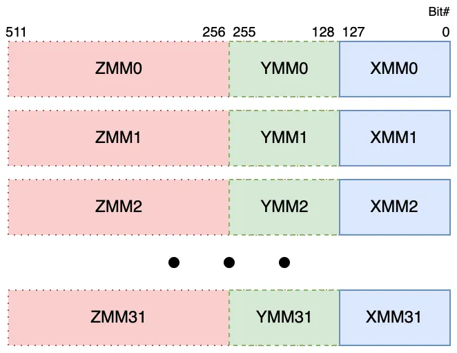

# Les extensions SIMD des CPU

## SIMD

Pour connaitre la liste des extensions SIMD sur un ordinateur sous Linux

# Vérification des flags CPU

```console
$ grep flags /proc/cpuinfo | head -1
flags		: fpu vme de pse tsc msr pae mce cx8 apic sep mtrr pge mca cmov pat pse36 clflush dts acpi mmx fxsr sse sse2 ht tm pbe syscall nx rdtscp lm
		constant_tsc arch_perfmon pebs bts rep_good nopl xtopology nonstop_tsc cpuid aperfmperf pni dtes64 monitor ds_cpl vmx est tm2 ssse3 cx16 xtpr
		pdcm pcid sse4_1 sse4_2 popcnt lahf_lm pti ssbd ibrs ibpb stibp tpr_shadow flexpriority ept vpid dtherm ida arat vnmi flush_l1d
```
ou dans la partie drapeaux
```console
$ lscpu
Architecture :                              x86_64
  Mode(s) opératoire(s) des processeurs :   32-bit, 64-bit
  Tailles des adresses:                     36 bits physical, 48 bits virtual
  Boutisme :                                Little Endian
Processeur(s) :                             4
  Liste de processeur(s) en ligne :         0-3
Identifiant constructeur :                  GenuineIntel
  Nom de modèle :                           Intel(R) Core(TM) i5 CPU       M 460
                                              @ 2.53GHz
    Famille de processeur :                 6
    Modèle :                                37
    Thread(s) par cœur :                    2
    Cœur(s) par socket :                    2
    Socket(s) :                             1
    Révision :                              5
    Accroissement de fréquence :            activé
    multiplication des MHz du/des CPU(s) :  68%
    Vitesse maximale du processeur en MHz : 2534,0000
    Vitesse minimale du processeur en MHz : 1199,0000
    BogoMIPS :                              5054,75
    Drapeaux :                              fpu vme de pse tsc msr pae mce cx8 a
                                            pic sep mtrr pge mca cmov pat pse36 
                                            clflush dts acpi mmx fxsr sse sse2 h
                                            t tm pbe syscall nx rdtscp lm consta
                                            nt_tsc arch_perfmon pebs bts rep_goo
                                            d nopl xtopology nonstop_tsc cpuid a
                                            perfmperf pni dtes64 monitor ds_cpl 
                                            vmx est tm2 ssse3 cx16 xtpr pdcm pci
                                            d sse4_1 sse4_2 popcnt lahf_lm pti s
                                            sbd ibrs ibpb stibp tpr_shadow flexp
                                            riority ept vpid dtherm ida arat vnm
                                            i flush_l1d
```

# Support SIMD par génération de CPU (Intel & AMD)

| Fabricant | Génération / Microarchitecture | Année | SSE | SSE2 | SSE3 | SSSE3 | SSE4.1 | SSE4.2 | AVX | AVX2 | AVX-512 |
|-----------|-------------------------------|-------|-----|------|------|-------|--------|--------|-----|------|---------|
| Intel     | NetBurst / Pentium 4           | 2000  | ✅  | ✅   | ✅   | ❌    | ❌     | ❌     | ❌  | ❌   | ❌      |
| Intel     | Core (1ère gen, Arrandale/Westmere mobile) | 2010 | ✅ | ✅ | ✅ | ✅ | ✅ | ✅ | ❌ | ❌ | ❌ |
| Intel     | Sandy Bridge (i3/i5/i7 2xxx)  | 2011  | ✅  | ✅   | ✅   | ✅    | ✅     | ✅     | ✅  | ❌   | ❌      |
| Intel     | Ivy Bridge / Haswell           | 2012-2013 | ✅ | ✅ | ✅ | ✅ | ✅ | ✅ | ✅ | ✅  | ❌      |
| Intel     | Skylake / Kaby Lake            | 2015-2017 | ✅ | ✅ | ✅ | ✅ | ✅ | ✅ | ✅ | ✅  | ✅      |
| AMD       | Bulldozer / FX                 | 2011  | ✅  | ✅   | ✅   | ✅    | ✅     | ✅     | ✅  | ❌   | ❌      |
| AMD       | Piledriver / Steamroller       | 2012-2013 | ✅  | ✅ | ✅ | ✅ | ✅ | ✅ | ✅ | ✅  | ❌      |
| AMD       | Ryzen (Zen)                    | 2017+ | ✅ | ✅ | ✅ | ✅ | ✅ | ✅ | ✅ | ✅ | ❌      |
| AMD       | Ryzen 5000 / 7000 (Zen3/Zen4) | 2020+ | ✅ | ✅ | ✅ | ✅ | ✅ | ✅ | ✅ | ✅ | ✅ (certains modèles) |

---

# Notes importantes

- ✅ : support officiel 
- ❌ : non supporté 
- AVX = 256-bit vector registers (YMM) 
- AVX2 = AVX + instructions entières vectorielles + FMA 
- AVX-512 = 512-bit vector registers (ZMM), support limité à certaines gammes récentes 
- Les générations plus anciennes comme **Arrandale / Core i5 M 460 (2010)** n’ont **pas AVX**, uniquement SSE4.2 au maximum


## SIMD

**SIMD** signifie **Single Instruction, Multiple Data**  
(en français : *Instruction unique, données multiples*).

Il s'agit d'un type d’architecture permettant à un processeur d’exécuter **la même opération sur plusieurs données en parallèle**.

### Exemple simple
Au lieu d’additionner :
- A + B
- C + D
- E + F

le processeur peut effectuer plusieurs additions en une seule instruction.

Le SIMD est particulièrement utilisé pour :
- Le traitement d’image
- L’audio
- La vidéo
- Les jeux vidéo
- Le calcul scientifique
- Le machine learning

---

# Extensions SIMD sur architecture x86

Les principales extensions SIMD sur processeurs x86 (Intel et AMD) sont :

---

## SSE

**SSE** = *Streaming SIMD Extensions*

Introduit par Intel avec le Pentium III (1999).

Caractéristiques :
- Registres de 128 bits (XMM)
- Principalement orienté calcul flottant (float 32 bits)
- Amélioration des performances multimédia

---

## SSE2

Extension majeure de SSE.

Ajoute :
- Support des nombres flottants double précision (64 bits)
- Instructions entières SIMD
- Devient une base standard sur les CPU modernes

---

## SSE3

Ajoute :
- Meilleure gestion des calculs complexes
- Optimisations supplémentaires pour le multithreading
- Instructions horizontales (ex : addition dans un même registre)

---

## SSE4

Divisé en :
- SSE4.1
- SSE4.2

Ajoute :
- Instructions de manipulation de texte
- Accélérations pour la recherche et comparaison
- Instructions spécialisées pour le multimédia

---

## AVX

**AVX** = *Advanced Vector Extensions*

Évolution majeure du SIMD.

Caractéristiques :
- Registres de 256 bits (YMM)
- Double la largeur des données par rapport à SSE
- Meilleure performance pour calcul scientifique et 3D

Versions suivantes :
- AVX2 (meilleur support des entiers)
- AVX-512 (512 bits, très haute performance)

---

## AES

**AES-NI** = *Advanced Encryption Standard New Instructions*

Ce n’est pas une extension SIMD générale, mais :
- Un ensemble d’instructions spécialisées
- Accélère le chiffrement/déchiffrement AES
- Utilisé pour la sécurité et le chiffrement disque

---

## FMA3

**FMA3** = *Fused Multiply-Add (3 operands)*

Permet d’effectuer :
    (A × B) + C

en une seule instruction.

Avantages :
- Plus rapide
- Plus précis (moins d’erreurs d’arrondi)
- Très utilisé en calcul scientifique et IA

---

# Résumé rapide

| Extension | Largeur | Usage principal |
|-----------|----------|-----------------|
| SSE       | 128 bits | Float simple précision |
| SSE2      | 128 bits | Float double + entiers |
| SSE3/4    | 128 bits | Optimisations diverses |
| AVX       | 256 bits | Calcul intensif |
| AES-NI    | 128 bits | Chiffrement |
| FMA3      | 256 bits | Calcul scientifique |

---


# Registres SIMD : XMM, YMM, ZMM

Les registres XMM, YMM et ZMM sont des registres vectoriels utilisés par les extensions SIMD des processeurs x86_64.

Ils permettent d'effectuer des opérations sur plusieurs données en parallèle.

| Registre | Taille | Extension | Nombre max |
|----------|--------|-----------|------------|
| XMM      | 128 bits (8,16,32)| SSE | 16 (xmm0 à xmm15)|
| YMM      | 256 bits (16,32) | AVX | 16 (ymm0 à ymm15)|
| ZMM      | 512 bits (32) | AVX-512 | 32 (zmm0 à zmm31)|

# Illustration du registre XMM



| Registre cible | Partie basse = | Taille concernée | Relation |
|---------------|---------------|-----------------|----------|
| YMMn         | XMMn         | 128 bits        | Les 128 bits bas de YMMn sont exactement XMMn |
| ZMMn         | YMMn         | 256 bits        | Les 256 bits bas de ZMMn sont exactement YMMn |
| ZMMn         | XMMn         | 128 bits        | Les 128 bits bas de ZMMn sont exactement XMMn |


# Conclusion

Les extensions SIMD permettent aux processeurs modernes :
- d’augmenter fortement les performances
- de traiter plusieurs données simultanément
- d’accélérer le multimédia, la cryptographie et le calcul scientifique


