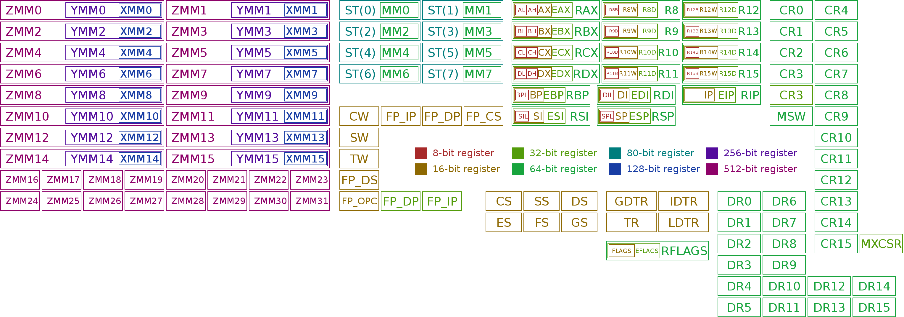
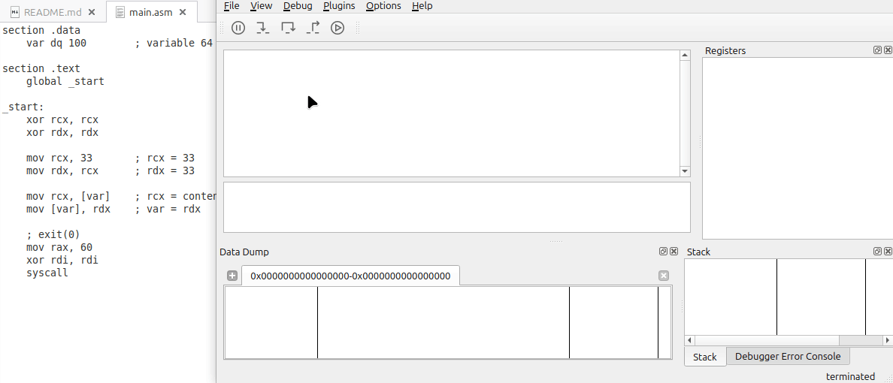

# x64_assembly

[asm_tutorial](https://sonictk.github.io/asm_tutorial/)

# x86-64 Registers




## General Purpose Registers (A, B, C, D)

| Register (64-bit) | Bits 63–32 | Bits 31–16 | Bits 15–8 | Bits 7–0 |
|-------------------|------------|------------|-----------|----------|
| RAX               | RAX[63:32] | EAX[31:16] | AH        | AL       |
| RBX               | RBX[63:32] | EBX[31:16] | BH        | BL       |
| RCX               | RCX[63:32] | ECX[31:16] | CH        | CL       |
| RDX               | RDX[63:32] | EDX[31:16] | DH        | DL       |

### Correspondance des sous-registres

| 64-bit | 32-bit | 16-bit | 8-bit High | 8-bit Low |
|------|------|------|------|------|
| RAX | EAX | AX | AH | AL |
| RBX | EBX | BX | BH | BL |
| RCX | ECX | CX | CH | CL |
| RDX | EDX | DX | DH | DL |

---

# 64-bit Mode Only Registers (R8–R15)

| Register (64-bit) | 32-bit | 16-bit | 8-bit |
|-------------------|--------|--------|-------|
| R8                | R8D    | R8W    | R8B   |
| R9                | R9D    | R9W    | R9B   |
| R10               | R10D   | R10W   | R10B  |
| R11               | R11D   | R11W   | R11B  |
| R12               | R12D   | R12W   | R12B  |
| R13               | R13D   | R13W   | R13B  |
| R14               | R14D   | R14W   | R14B  |
| R15               | R15D   | R15W   | R15B  |

---

# Special Purpose Registers

| Register | Description          |
|----------|----------------------|
| RIP      | Instruction Pointer  |
| RSP      | Stack Pointer        |
| RBP      | Base Pointer         |
| RSI      | Source Index         |
| RDI      | Destination Index    |

---

# RFLAGS Register

| Bit Position | Flag | Description               |
|--------------|------|---------------------------|
| 0            | CF   | Carry Flag                |
| 2            | PF   | Parity Flag               |
| 4            | AF   | Auxiliary Carry Flag      |
| 6            | ZF   | Zero Flag                 |
| 7            | SF   | Sign Flag                 |
| 8            | TF   | Trap Flag                 |
| 9            | IF   | Interrupt Enable Flag     |
| 10           | DF   | Direction Flag            |
| 11           | OF   | Overflow Flag             |

---

| Register | Description |
|----------|-------------|
| RFLAGS   | CPU Status Flags Register (64-bit) |

---


### Visualisation de RFLAGS (bits 11 à 0)

| Bit 11 | Bit 10 | Bit 9 | Bit 8 | Bit 7 | Bit 6 | Bit 5 | Bit 4 | Bit 3 | Bit 2 | Bit 1 | Bit 0 |
|--------|--------|-------|-------|-------|-------|-------|-------|-------|-------|-------|-------|
| OF     | DF     | IF    | TF    | SF    | ZF    | -     | AF    | -     | PF    | -     | CF    |

---

# Register Summary Table

# Table des registres x86-64

| Registre    | Taille      | Usage / Description                            |
|-------------|-------------|-----------------------------------------------|
| **Registres généraux 64-bit**                               |
| RAX         | 64-bit      | Accumulateur (math, valeurs retour)           |
| RBX         | 64-bit      | Base register                                  |
| RCX         | 64-bit      | Compteur (boucles, décalages)                  |
| RDX         | 64-bit      | Registre données                               |
| RSI         | 64-bit      | Source index (opérations chaînes)              |
| RDI         | 64-bit      | Destination index                              |
| RBP         | 64-bit      | Base pointer (cadre de pile)                    |
| RSP         | 64-bit      | Stack pointer (pointeur de pile)                |
| RIP         | 64-bit      | Instruction pointer (adresse courante)         |
| R8 - R15    | 64-bit      | Registres généraux supplémentaires (64-bit)    |

| **Registres généraux 32-bit**                              |
| EAX         | 32-bit      | Partie basse 32-bit de RAX                      |
| EBX         | 32-bit      | Partie basse 32-bit de RBX                      |
| ECX         | 32-bit      | Partie basse 32-bit de RCX                      |
| EDX         | 32-bit      | Partie basse 32-bit de RDX                      |
| ESI         | 32-bit      | Partie basse 32-bit de RSI                      |
| EDI         | 32-bit      | Partie basse 32-bit de RDI                      |
| EBP         | 32-bit      | Partie basse 32-bit de RBP                      |
| ESP         | 32-bit      | Partie basse 32-bit de RSP                      |
| R8D - R15D  | 32-bit      | Partie basse 32-bit de R8-R15                   |

| **Registres généraux 16-bit**                              |
| AX          | 16-bit      | Partie basse 16-bit de RAX                      |
| BX          | 16-bit      | Partie basse 16-bit de RBX                      |
| CX          | 16-bit      | Partie basse 16-bit de RCX                      |
| DX          | 16-bit      | Partie basse 16-bit de RDX                      |
| SI          | 16-bit      | Partie basse 16-bit de RSI                      |
| DI          | 16-bit      | Partie basse 16-bit de RDI                      |
| BP          | 16-bit      | Partie basse 16-bit de RBP                      |
| SP          | 16-bit      | Partie basse 16-bit de RSP                      |
| R8W - R15W  | 16-bit      | Partie basse 16-bit de R8-R15                   |

| **Registres généraux 8-bit**                               |
| AL, AH      | 8-bit       | Parties basse (AL) et haute (AH) de AX          |
| BL, BH      | 8-bit       | Parties basse (BL) et haute (BH) de BX          |
| CL, CH      | 8-bit       | Parties basse (CL) et haute (CH) de CX          |
| DL, DH      | 8-bit       | Parties basse (DL) et haute (DH) de DX          |
| SIL, DIL    | 8-bit       | Parties basses 8-bit de SI et DI                 |
| BPL, SPL    | 8-bit       | Parties basses 8-bit de BP et SP                 |
| R8B - R15B  | 8-bit       | Parties basses 8-bit de R8-R15                    |

| **Registres SIMD / Vectoriels**                           |
| XMM0 - XMM15 | 128-bit    | Registres SSE / SIMD                             |
| YMM0 - YMM15 | 256-bit    | Registres AVX                                   |
| ZMM0 - ZMM31 | 512-bit    | Registres AVX-512                               |

| **Registres MMX (FPU integer registers)**                |
| MM0 - MM7    | 64-bit     | Registres MMX                                   |

| **Registres de contrôle**                                |
| CR0 - CR15   | 64-bit     | Registres de contrôle du CPU                    |

| **Registres de débogage**                                |
| DR0 - DR15   | 64-bit     | Registres de débogage                            |

| **Registres de segment**                                 |
| CS, DS, SS, ES, FS, GS | 16-bit | Registres de segment                   |

| **Registres du FPU (Floating Point Unit)**               |
| CW, SW, TW   | 16-bit     | Control, Status, Tag Word                      |
| FP_IP, FP_DP | 32-bit     | Instruction Pointer, Data Pointer (FPU)       |
| FP_CS        | 16-bit     | Code Segment (FPU)                             |
| FP_OPC       | 16-bit     | Opcode (FPU)                                   |

| **Registre Flags**                                       |
| RFLAGS, EFLAGS, FLAGS | 64/32/16-bit | Registre des flags CPU (état, contrôle)  |

| **Registres spéciaux**                                  |
| MXCSR        | 32-bit     | Registre de contrôle SSE                       |
| GDTR, IDTR, LDTR, TR | N/A | Registres de descripteurs et trace           |


---

# Stack Layout Example

### Stack Layout

| Stack Section       | Description          |
|--------------------|--------------------|
| High Address        |                    |
| Function args       | Arguments passed to the function |
| Return Address      | Address to return after function call |
| Old RBP             | Saved base pointer (previous stack frame) |
| Local Variables     | Variables local to the function |
| Low Address         |                    |

---

# Quick Notes

- Writing to a **32-bit register (EAX)** clears the upper 32 bits of **RAX**.
- Stack grows **downwards** in memory.
- `RIP` cannot be accessed directly like general registers.
- `RFLAGS` stores CPU status flags used by conditional jumps.

# Compiler et exécuter `main.asm` avec NASM et un Makefile

Ce projet utilise **NASM** pour assembler le code et **ld** pour créer l'exécutable.

Le fichier `Makefile` fourni automatise ces étapes.

---

# 1. Prérequis

Vous devez avoir installés :

- **nasm** (assembleur)
- **ld** (linker GNU, généralement fourni avec `binutils`)
- **make**

### Vérifier l'installation

```bash
nasm -v
ld -v
make -v
```

Si une commande n'existe pas :

### Ubuntu / Debian

```bash
sudo apt install nasm build-essential
```

### Arch Linux

```bash
sudo pacman -S nasm base-devel
```

### Fedora

```bash
sudo dnf install nasm make gcc
```

---

# 2. Structure du projet

Exemple de dossier :

```
project/
│
├── main.asm
└── Makefile
```

---

# 3. Contenu du Makefile

```make
ASM = nasm
ASMFLAGS = -f elf64 -g -F dwarf

LD = ld
LDFLAGS = 

all: main

main: main.o
	$(LD) -o main main.o $(LDFLAGS)

main.o: main.asm
	$(ASM) $(ASMFLAGS) main.asm -o main.o

clean:
	rm -f *.o main
```

---

# 4. Explication du Makefile

## Assembleur

```
ASM = nasm
```

Utilise **NASM** comme assembleur.

---

## Flags d'assemblage

```
ASMFLAGS = -f elf64 -g -F dwarf
```

Signification :

| Option | Description |
|------|------|
| `-f elf64` | génère un objet ELF 64-bit pour Linux |
| `-g` | ajoute les symboles de debug |
| `-F dwarf` | format de debug utilisé par gdb |

---

## Linker

```
LD = ld
```

Utilise **ld** pour créer l'exécutable.

---

## Règle par défaut

```
all: main
```

Quand on exécute :

```bash
make
```

`make` construit la cible **main**.

---

## Création de l'exécutable

```
main: main.o
	$(LD) -o main main.o $(LDFLAGS)
```

Cette règle signifie :

1. si `main.o` existe
2. alors `ld` crée l'exécutable `main`

Commande réelle exécutée :

```bash
ld -o main main.o
```

---

## Assemblage

```
main.o: main.asm
	$(ASM) $(ASMFLAGS) main.asm -o main.o
```

Si `main.asm` change :

```
nasm -f elf64 -g -F dwarf main.asm -o main.o
```

Cela produit :

```
main.o
```

qui est un **fichier objet ELF64**.

---

## Nettoyage

```
clean:
	rm -f *.o main
```

Commande :

```bash
make clean
```

supprime :

```
main.o
main
```

---

# 5. Compilation

Dans le dossier contenant `Makefile` et `main.asm` :

```bash
make
```

Étapes exécutées :

```
nasm -f elf64 -g -F dwarf main.asm -o main.o
ld -o main main.o
```

Résultat :

```
main
```

qui est l'exécutable.

---

# 6. Vérifier que le programme est exécutable

```bash
ls -l main
```

Exemple :

```
-rwxr-xr-x 1 user user 9000 main
```

Le `x` indique que le fichier est **exécutable**.

Si nécessaire :

```bash
chmod +x main
```

---

# 7. Exécuter le programme

```bash
./main
```

Le `./` indique au shell d'exécuter le fichier dans le dossier courant.

---

# 8. Exemple minimal de `main.asm`

```asm
section .data
msg db "Hello x86-64", 10
len equ $ - msg

section .text
global _start

_start:

    mov rax, 1
    mov rdi, 1
    mov rsi, msg
    mov rdx, len
    syscall

    mov rax, 60
    xor rdi, rdi
    syscall
```

---

# 9. Cycle de développement

### Compiler

```bash
make
```

### Exécuter

```bash
./main
```

### Nettoyer

```bash
make clean
```

---

# 10. Résumé

| Commande | Action |
|------|------|
| `make` | compile le programme |
| `./main` | exécute le programme |
| `make clean` | supprime les fichiers générés |

---

# 11. Schéma du processus

```
main.asm
   │
   │ nasm
   ▼
main.o
   │
   │ ld
   ▼
main (exécutable)
   │
   ▼
./main
```

---

# Minimal Assembly Example

```bash
ale@ale-desktop:~/asm_linux/x64_assembly/52-hello$ ./main 
Hello world!
ale@ale-desktop:~/asm_linux/x64_assembly/52-hello$ 

```


# NASM — Déclarations de variables

## Section .data (variables initialisées)

| Directive | Taille | Description |
|------------|--------|-------------|
| db | 1 octet  | define byte |
| dw | 2 octets | define word |
| dd | 4 octets | define double word |
| dq | 8 octets | define quad word |
| dt | 10 octets | define ten bytes (float étendu x87) |

### Exemples

var8    db  10
str     db  'abc', 0

var16   dw  1000
var32   dd  100000
var64   dq  10000000000

tab8    db  1,2,3,4,5
tab32   dd  10,20,30


---

## Section .bss (variables non initialisées)

| Directive | Réserve |
|------------|----------|
| resb | bytes |
| resw | words (2 bytes) |
| resd | dwords (4 bytes) |
| resq | qwords (8 bytes) |
| rest | 10 bytes |

### Exemples

buf8    resb 16
buf16   resw 8
buf32   resd 4
buf64   resq 2


---

## Correspondance avec registres

| Taille | Registre 8/16/32/64 bits |
|----------|--------------------------|
| 8 bits   | AL |
| 16 bits  | AX |
| 32 bits  | EAX |
| 64 bits  | RAX |

---

## Particularités de `mov` sur variables

Quand on écrit dans une adresse mémoire, NASM **ne déduit pas la taille automatiquement**. 

### Exemples d’écriture en mémoire

mov byte [match], 1       ; écrit 1 octet (8 bits) à l'adresse de match 
mov word [match], 123     ; écrit 2 octets (16 bits) 
mov dword [match], 100000 ; écrit 4 octets (32 bits) 
mov qword [match], 10000000000 ; écrit 8 octets (64 bits) 

- La taille doit toujours être précisée (`byte`, `word`, `dword`, `qword`) pour éviter l'erreur : 
  operation size not specified 

### Exemples de lecture mémoire selon le registre

mov al, [match]   ; AL = 8 bits → NASM sait qu'on lit 1 octet 
mov ax, [match]   ; AX = 16 bits → NASM sait qu'on lit 2 octets 
mov eax, [match]  ; EAX = 32 bits → NASM sait qu'on lit 4 octets 
mov rax, [match]  ; RAX = 64 bits → NASM sait qu'on lit 8 octets 

### Exemples d’écriture dans un registre (taille implicite)

mov al, 100       ; AL = 8 bits 
mov ax, 100       ; AX = 16 bits 
mov eax, 100      ; EAX = 32 bits 
mov rax, 100      ; RAX = 64 bits 

---

# Calling Convention (System V - Linux/macOS)

First arguments passed in registers:

| Argument | Register |
|--------|--------|
| 1 | RDI |
| 2 | RSI |
| 3 | RDX |
| 4 | RCX |
| 5 | R8 |
| 6 | R9 |

Return value:

```
RAX

```
# Installer EDB Debugger sous Linux Mint

**EDB (Evan's Debugger)** est un débogueur graphique pour Linux similaire à **OllyDbg** sous Windows.  
Il est très utilisé pour analyser des programmes **x86 / x86-64**.

Site officiel :  
https://github.com/eteran/edb-debugger

Ce guide explique comment l’installer sous **Linux Mint**.

---

# 1. Installation via APT (méthode la plus simple)

Sous Linux Mint, `edb-debugger` est souvent disponible directement dans les dépôts.

Mettre à jour les paquets :

```bash
sudo apt update
```

Installer EDB :

```bash
sudo apt install edb-debugger
```

---

# 2. Vérifier l'installation

Vérifier que le programme est installé :

```bash
edb --version
```

ou lancer directement :

```bash
edb
```

---

# 3. Lancer EDB

Vous pouvez lancer EDB de deux façons.

### Depuis le terminal

```bash
edb
```

### Depuis le menu graphique

Menu :

```
Menu → Programming → EDB Debugger
```

---

# 4. Déboguer un programme

Exemple avec un programme compilé :

```bash
./main
```

Pour le déboguer :

```bash
edb ./main
```

Ou ouvrir le programme depuis l'interface :

```
File → Open → sélectionner l'exécutable
```

---



# 5. Installer les outils utiles pour le debugging

Pour un environnement complet :

```bash
sudo apt install build-essential nasm gdb
```

Cela installe :

| Outil | Utilité |
|------|------|
| gcc | compilation C |
| make | automatisation build |
| nasm | assembleur |
| gdb | debugger CLI |

---

# 6. Installation manuelle depuis GitHub (si non disponible)

Si `edb-debugger` n'est pas dans les dépôts :

Installer les dépendances :

```bash
sudo apt install git cmake build-essential qtbase5-dev libqt5svg5-dev
```

Cloner le projet :

```bash
git clone https://github.com/eteran/edb-debugger.git
```

Entrer dans le dossier :

```bash
cd edb-debugger
```

Créer un dossier de build :

```bash
mkdir build
cd build
```

Compiler :

```bash
cmake ..
make
```

Installer :

```bash
sudo make install
```

---

# 7. Vérifier que le debugger fonctionne

Lancer :

```bash
edb
```

Si l'interface graphique apparaît, l'installation est réussie.

---

# 8. Désinstallation

Si installé via apt :

```bash
sudo apt remove edb-debugger
```

Pour supprimer aussi la configuration :

```bash
sudo apt purge edb-debugger
```

---

# 9. Vérifier l'architecture du programme

EDB fonctionne avec les binaires **ELF x86 et x86-64**.

Pour vérifier un programme :

```bash
file main
```

Exemple :

```
main: ELF 64-bit LSB executable, x86-64
```

---

# 10. Exemple de workflow complet

Compiler un programme assembleur :

```bash
make
```

Lancer le debugger :

```bash
edb ./main
```

Déboguer :

```
F7 → Step Into
F8 → Step Over
F9 → Run
```

---

# 11. Commandes utiles

| Commande | Description |
|------|------|
| edb | lancer le debugger |
| edb ./programme | déboguer un programme |
| file programme | vérifier le type ELF |
| make | compiler le programme |

---

# 12. Résumé

Installation rapide :

```bash
sudo apt update
sudo apt install edb-debugger
edb
```

EDB est maintenant prêt pour analyser et déboguer vos programmes **x86 / x86-64**.

